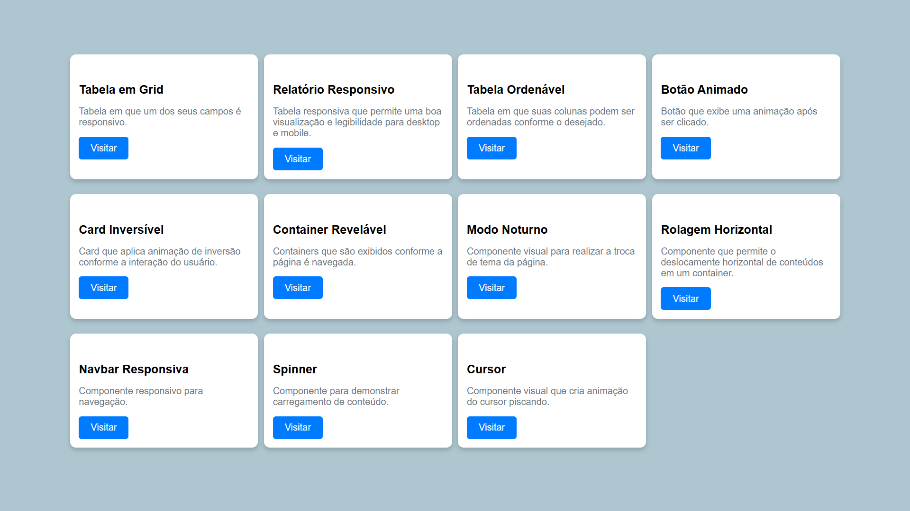

## Apresentação Geral

**Nome do Projeto:** Frontend Sandbox

**Descrição:**

O Frontend Sandbox serve como uma galeria dos meus pequenos projetos e experimentos de front-end.  
Aqui, você encontrará projetos pessoais que solucionam necessidades específicas e projetos de estudo desenvolvidos a partir de tutoriais.

**Objetivo:**

Implementar uma interface que permita a navegação entre meus projetos experimentais.

**Tecnologias Utilizadas:**

## Contato

